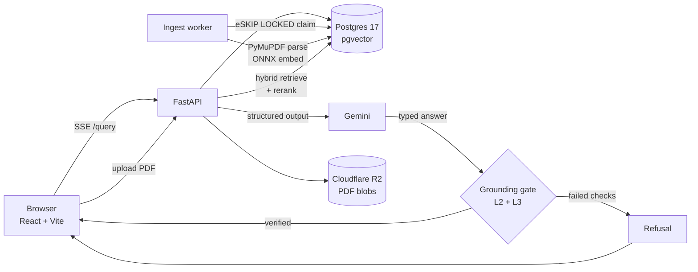

# ChatDoc

**Grounded question answering over financial PDFs, with clickable citations and an explicit refusal path.**

Ask a question about a 10-K or an earnings release. ChatDoc answers with a citation that jumps to the exact page and highlights the sentence the number came from. When the filing does not actually contain the answer, it says so instead of guessing.

> Live demo: _add your deployed URL here_

---

## The problem this solves

A general RAG chatbot pointed at a 200 page filing will confidently produce a number that appears nowhere in the document. For financial data that failure is worse than no answer at all, because the output looks exactly like a correct one.

ChatDoc treats refusal as a first class outcome. Every figure the model returns has to survive a set of programmatic checks against the retrieved source text before it ever reaches the user:

1. The model fills a **typed schema** (`sufficient`, `value`, `scale`, `operands`, `citations`) rather than free prose a parser has to guess at.
2. Every cited `chunk_id` must be one that retrieval actually returned.
3. Every numeric value and every operand behind a derived figure (growth rates, ratios) must be **findable as a literal substring** in the chunk it cites, after un-scaling for footnotes like "in millions".
4. Anything that fails returns a fixed refusal string.

Because the checks are pure functions over an already parsed response, they cost zero extra model calls and can be replayed offline against a cached evaluation run.

---

## Architecture



**Request path:** upload returns `202` immediately and enqueues a row in a `jobs` table. A worker claims it with `FOR UPDATE SKIP LOCKED`, runs the ingest pipeline, and writes live stage progress (`reading`, `chunking`, `embedding`, `indexing`) back to the `documents` row so the client can poll a real progress bar instead of an opaque spinner.

---

## How it works

### Ingestion

Table aware chunking via PyMuPDF produces two chunk types per page:

| Chunk type | Handling |
| --- | --- |
| `table` | One atomic chunk per detected table, serialized to Markdown, never split. Scale and currency metadata ("in thousands", "USD") sniffed from nearby footnotes. Bounding box captured for region level citation highlighting. |
| `prose` | Paragraph chunked at 1600 characters with 200 character overlap, with the nearest preceding section header prefixed onto each chunk so it survives retrieval out of context. |

Keeping a table's rows attached to their headers and their scale footnote is what makes "total net sales, in millions" resolvable later. A scanned PDF with no text layer fails loudly rather than silently ingesting an empty chunk set, since there is no OCR in scope.

### Retrieval

Hybrid search, fused, then reranked:

- **Dense:** `halfvec(384)` cosine over an HNSW index, embeddings from `BAAI/bge-small-en-v1.5` as an int8 ONNX export.
- **Sparse:** Postgres `tsvector` / `tsquery` with a GIN index, as a `GENERATED ALWAYS AS ... STORED` column so it stays in sync without a trigger.
- **Fusion:** Reciprocal Rank Fusion at k=60.
- **Rerank:** `ms-marco-MiniLM-L-6-v2` cross encoder, ONNX, CPU.

Exact line items in financial tables are precisely where pure vector search underperforms, which is why the keyword half stays in the loop.

### Streaming

`POST /query` is Server Sent Events: a 2KB comment padding frame to punch through proxy buffering, `: heartbeat` comments every 15 seconds so the connection survives idle model latency, a `delta` event per generated chunk, and always a terminal `done` event so the client can tell "finished" apart from "connection dropped". There is deliberately no gzip middleware anywhere in the app, since it buffers SSE and produces streams that look complete but are not.

---

## Engineering decisions worth a look

These are the parts a reviewer might find more interesting than the feature list.

**Crash safe ingest queue without a broker.** No Redis, no Celery. A `jobs` table plus `FOR UPDATE SKIP LOCKED` and a `visible_at` reclaim window. Killing the worker mid ingest leaves the row in `processing`; the next worker to start, including the same process after a restart, reclaims it automatically. `attempts` and `max_attempts` dead letter a poison pill PDF instead of looping forever. `scripts/kill_worker_test.py` SIGKILLs a real worker container to prove it.

**One image, two roles.** The API and the worker ship from a single Dockerfile, differing only by `CMD`. Render's free tier has no Background Worker service type, so `RUN_WORKER_INLINE=true` starts the worker's poll loop as a daemon thread inside the web process there, while local Docker Compose keeps them as separate containers so the SIGKILL test can target the worker independently. The queue semantics are identical either way.

**CSRF across unrelated origins.** The frontend (Vercel) and API (Render) do not share a registrable domain, so the classic double submit pattern of reading the token from `document.cookie` cannot work: the frontend can never see a cookie the API set. The API returns the token in an `X-CSRF-Token` response header instead (explicitly listed in CORS `expose_headers`, since cross origin fetch hides response headers by default) and the client caches it in memory. The cookie is still set and still required on the request side.

**Sessions in Postgres, not JWTs.** Opaque random tokens in a `sessions` table, so a session can be revoked immediately and its expiry can slide on activity. A 12 hour idle timeout with a 14 day absolute backstop. This is a requirement, not a preference: a live SSE generation must not outlive its own cookie.

**Model weights baked into the image.** Render's free plan has no persistent disk, so both ONNX checkpoints are downloaded and cached at Docker build time rather than on the first request after a cold start. Embeddings run single threaded on purpose (`intra_op_num_threads=1`) to hold a predictable memory footprint on a small box, and the stack avoids importing torch entirely, which alone would cost several hundred MB of RSS.

**Evaluation that costs nothing in CI.** Grading is a pure function over cached generation rows, so `scripts/check_eval_regression.py` replays the whole gate config from a small committed SQLite snapshot with zero API calls possible, and fails the build if accuracy on the answerable split drops or hallucination rate on any negative tier rises past tolerance.

---

## Evaluation

Built on FinanceBench filings, with a four tier negative taxonomy so that "it refused" can be scored honestly rather than assumed:

| Tier | What it tests |
| --- | --- |
| N0 | Wrong company entirely. A sanity floor, reported separately, never the headline number. |
| N1 | Same document with the evidence page removed. The hardest tier: the filing looks right and the answer is genuinely absent. |
| N2 | Temporal mismatch. A different fiscal year for the same company. |
| N3 | False premise. Hand written questions that presuppose something untrue. |

Items where the gold figure leaks elsewhere in the document are dropped at build time, so a "correct refusal" cannot be scored against a document that actually contains the answer.

The harness reports accuracy on the answerable split and hallucination rate per tier across four gate configurations (`none`, `L2`, `L2+L3`, `L1+L2+L3`), plus a risk coverage sweep. Committed baselines and tolerances live in `scripts/check_eval_regression.py`.

---

## Tech stack

| Layer | Choice |
| --- | --- |
| API | FastAPI, Python 3.13, uv |
| Database | Postgres 17, pgvector (halfvec + HNSW), tsvector + GIN |
| PDF parsing | PyMuPDF |
| Embeddings | bge-small-en-v1.5, int8 ONNX via fastembed, CPU |
| Reranker | ms-marco-MiniLM-L-6-v2 cross encoder, ONNX |
| LLM | Gemini via google-genai, structured output |
| Auth | Argon2, HttpOnly cookie sessions, double submit CSRF |
| Blob storage | Cloudflare R2 (boto3), local disk fallback |
| Frontend | React 19, TypeScript, Vite, React Router, TanStack Query, pdf.js |
| Observability | OpenTelemetry stage latency spans |
| Deploy | Vercel (web), Render (Docker), Neon (Postgres) |

---

## Running locally

**Prerequisites:** Docker, Node 20+, and a Gemini API key.

Create a `.env` in the repo root:

```bash
GEMINI_API_KEY=your_key_here

# Optional. Leave blank to store uploads on the local Docker volume instead of R2.
R2_ACCOUNT_ID=
R2_ACCESS_KEY_ID=
R2_SECRET_ACCESS_KEY=
R2_BUCKET_NAME=
```

Start Postgres, the API, and the ingest worker:

```bash
docker compose up -d --build
```

Apply the schema (creates the pgvector extension, tables, and indexes):

```bash
docker exec -i chatdoc_db psql -U chatdoc -d chatdoc < db/schema.sql
```

Start the frontend:

```bash
cd web && npm install && npm run dev
```

The app is at `http://localhost:5173`, the API at `http://localhost:8000`, and interactive API docs at `http://localhost:8000/docs`.

`DATABASE_URL` and `CLIENT_ORIGIN` are set in `docker-compose.yml` for the containers and only need to be in `.env` if you run the API directly on the host.

---

## Tests

```bash
uv run pytest                                  # cross user isolation, query cancellation
uv run python scripts/check_eval_regression.py # quality gate, zero API calls
uv run python scripts/kill_worker_test.py      # SIGKILL a worker mid ingest, assert recovery
npm run test:perf --prefix web                 # browser measured p95 time to first token
k6 run scripts/load_test.js                    # concurrent streaming sessions
```

The perf and load tests make real Gemini calls and are run manually, not in CI.

---

## Project layout

```
api/        FastAPI routes, auth, CSRF, storage, ingest worker, job queue
ingest/     PDF chunking, embeddings, reranker, hybrid retrieval, tracing
eval/       Grounding gate, structured output schema, dataset builders, ablation harness
db/         schema.sql (tables, HNSW and GIN indexes, migrations)
scripts/    Regression gate, crash recovery tests, benchmarks, k6 load test
tests/      pytest suite
web/        React frontend (PDF viewer, SSE client, citation highlighting)
```
